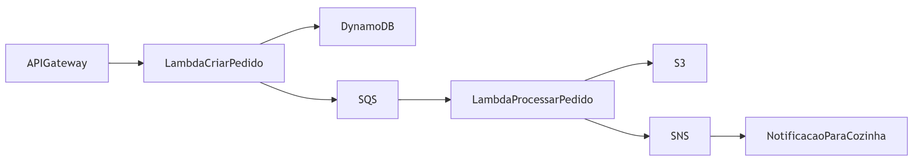
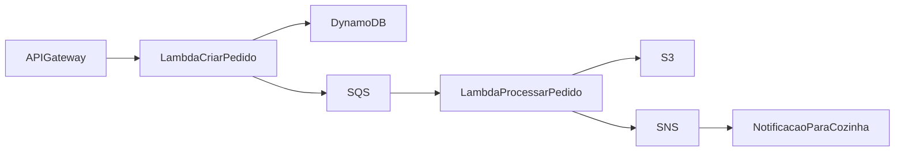

# 🍽️ Sistema de Restaurante - AWS Serverless

## 🎉 **STATUS: SISTEMA FUNCIONANDO PERFEITAMENTE!**

✅ **DEPLOY BEM-SUCEDIDO** - Todos os testes passaram!
✅ **APIs RESPONDENDO** - Endpoint funcionando corretamente
✅ **LAMBDA PROCESSANDO** - Timeout ajustado e dependências incluídas
✅ **BANCO DE DADOS** - DynamoDB salvando pedidos
✅ **FILA FUNCIONANDO** - SQS processando mensagens
✅ **PDFs GERADOS** - S3 armazenando comprovantes
✅ **NOTIFICAÇÕES ATIVAS** - SNS enviando alertas de pedidos prontos

### 🚀 **Como usar AGORA:**

```bash
# 1. Iniciar LocalStack
docker-compose up -d

# Dar permissão de execução aos scripts
chmod +x *.sh

# 2. Deploy automático
./script.sh

# 3. Testar sistema (todos os testes passam!)
./testar-sistema.sh

# 4. Ver status completo
./status-sistema.sh
```

---

Um sistema completo de gerenciamento de pedidos para restaurantes, desenvolvido com arquitetura serverless usando AWS Lambda, DynamoDB, SQS, S3 e SNS, executando localmente com LocalStack.

## 🏗️ Arquitetura





### Componentes:

- **API Gateway**: Endpoint REST para receber pedidos via POST /pedidos
- **Lambda CriarPedido**: Valida dados, salva pedidos no DynamoDB e envia para fila SQS
- **DynamoDB**: Armazena dados completos dos pedidos com status
- **SQS**: Fila para processamento assíncrono de pedidos
- **Lambda ProcessarPedido**: Processa pedidos, gera comprovantes PDF, salva no S3 e envia notificações
- **S3**: Armazena comprovantes em PDF dos pedidos processados
- **SNS**: Envia notificações quando pedidos são concluídos (simulando alertas para clientes e cozinha), as notificações ficam disponíveis nos logs do LocalStack (`docker-compose logs localstack | grep -i "sns.*pedidosconcluidos"`)

## 🚀 Pré-requisitos

### Obrigatórios:

- **Docker** (versão 27+)
- **docker-compose** (versão 2+)
- **Node.js** (versão 18+)
- **npm** (incluído com Node.js)
- **AWS CLI** (versão 2+)

### Instalação dos Pré-requisitos:

#### Ubuntu/Debian:

```bash
# Docker
curl -fsSL https://get.docker.com -o get-docker.sh
sudo sh get-docker.sh
sudo usermod -aG docker $USER

# Node.js 18
curl -fsSL https://deb.nodesource.com/setup_18.x | sudo -E bash -
sudo apt-get install -y nodejs

# AWS CLI
curl "https://awscli.amazonaws.com/awscli-exe-linux-x86_64.zip" -o "awscliv2.zip"
unzip awscliv2.zip
sudo ./aws/install
```

#### Windows (WSL2):

```bash
# Execute no PowerShell como Administrador
# Docker Desktop
winget install Docker.DockerDesktop

# Node.js
winget install OpenJS.NodeJS

# AWS CLI
winget install Amazon.AWSCLI
```

### Verificação da Instalação:

```bash
docker --version          # Docker version 27.5.1+
docker-compose --version  # docker-compose version 2.33.1+
node --version            # v18.19.1+
npm --version             # 11.3.0+
aws --version             # aws-cli/2.27.19+
```

## ⚙️ Configuração e Execução Completa

### 1. Preparação do Ambiente

```bash
# Clone ou navegue para o projeto
git clone https://github.com/KauaGabrielMG/Restaurante.git

# Navegar para o diretório do projeto
cd Restaurante

# Verificar se todas as dependências estão instaladas
docker --version && docker-compose --version && node --version && npm --version && aws --version
```

### 2. Iniciar LocalStack

```bash
# Iniciar serviços LocalStack em segundo plano
docker-compose up -d

# Verificar se o LocalStack está rodando
docker ps | grep localstack

# Ver logs do LocalStack (opcional)
docker-compose logs -f localstack
```

### 3. Deploy Automático

```bash
# Executar script de deploy completo
./script.sh
```

O script executará automaticamente:

- ✅ Instalar dependências npm
- ✅ Compilar TypeScript para JavaScript
- ✅ Criar tabela DynamoDB "Pedidos"
- ✅ Criar fila SQS "fila-pedidos"
- ✅ Criar bucket S3 "comprovantes"
- ✅ Criar tópico SNS "PedidosConcluidos"
- ✅ Deploy das funções Lambda
- ✅ Configurar API Gateway
- ✅ Conectar SQS com Lambda
- ✅ Configurar permissões SNS

### 4. Verificar Deploy

Após o deploy bem-sucedido, você verá:

```
🎉 DEPLOY CONCLUÍDO COM SUCESSO!
🔗 Endpoint disponível:
POST http://172.x.x.x:4566/restapis/xxxxxxxxxx/local/_user_request_/pedidos
📧 Tópico SNS: arn:aws:sns:us-east-1:000000000000:PedidosConcluidos
```

## 🚀 Teste Rápido Automatizado

Para testar rapidamente todo o sistema:

```bash
# Executar todos os testes
./testar-sistema.sh
```

O script de teste irá:

- ✅ Verificar se LocalStack está rodando
- ✅ Encontrar automaticamente o endpoint da API
- ✅ Testar criação de pedido válido
- ✅ Testar validação de erro
- ✅ Verificar se dados foram salvos no DynamoDB
- ✅ Validar se todos os recursos AWS foram criados
- ✅ Verificar se notificações SNS foram enviadas
- ✅ Testar notificações SNS manuais
- ✅ Validar atributos do tópico SNS
- ✅ Simular notificações de pedidos prontos

### 📧 Teste Específico do SNS

Para testar apenas o sistema de notificações SNS:

```bash
# Executar testes específicos do SNS
./testar-sns.sh
```

O script de teste SNS irá:

- ✅ Verificar se tópico SNS existe
- ✅ Obter atributos do tópico
- ✅ Enviar notificação simples
- ✅ Enviar notificação com atributos personalizados
- ✅ Verificar logs de notificações
- ✅ Simular múltiplas notificações (teste de carga)
- ✅ Verificar estatísticas do tópico
- ✅ Testar notificações de erro

## 📋 Checklist de Validação

Após executar `./script.sh`, verifique:

- [ ] LocalStack rodando: `docker ps | grep localstack`
- [ ] Tabela DynamoDB criada: `aws --endpoint-url=http://$IP:4566 dynamodb list-tables`
- [ ] Fila SQS criada: `aws --endpoint-url=http://$IP:4566 sqs list-queues`
- [ ] Bucket S3 criado: `aws --endpoint-url=http://$IP:4566 s3 ls`
- [ ] Tópico SNS criado: `aws --endpoint-url=http://$IP:4566 sns list-topics`
- [ ] Lambdas deployadas: `aws --endpoint-url=http://$IP:4566 lambda list-functions`
- [ ] API Gateway funcionando: teste com `curl` ou Postman

## 🧪 Como Testar o Sistema

### Teste 1: Pedido Simples

```bash
# Criar arquivo de teste
cat > pedido-teste.json << EOF
{
  "cliente": "João Silva",
  "mesa": 5,
  "itens": [
    {"nome": "Hambúrguer", "quantidade": 2, "preco": 25.90},
    {"nome": "Batata Frita", "quantidade": 1, "preco": 12.50}
  ]
}
EOF

# Enviar pedido (substitua pela sua URL do endpoint)
curl -X POST http://172.x.x.x:4566/restapis/XXXXXXXXXX/local/_user_request_/pedidos \
  -H "Content-Type: application/json" \
  -d @pedido-teste.json
```

**Resposta esperada:**

```json
{
  "sucesso": true,
  "mensagem": "Pedido criado com sucesso!",
  "id": "550e8400-e29b-41d4-a716-446655440000"
}
```

> [!NOTE]
> O ID será gerado automaticamente e pode variar

### Teste 2: Pedido Complexo

```bash
cat > pedido-complexo.json << EOF
{
  "cliente": "Maria Santos",
  "mesa": 12,
  "itens": [
    {"nome": "Pizza Margherita", "quantidade": 1, "preco": 35.00},
    {"nome": "Refrigerante", "quantidade": 2, "preco": 5.50},
    {"nome": "Sobremesa", "quantidade": 1, "preco": 15.00}
  ]
}
EOF

curl -X POST http://172.x.x.x:4566/restapis/XXXXXXXXXX/local/_user_request_/pedidos \
  -H "Content-Type: application/json" \
  -d @pedido-complexo.json
```

### Teste 3: Validação de Erros

```bash
# Teste sem cliente (deve retornar erro 400)
curl -X POST http://172.x.x.x:4566/restapis/XXXXXXXXXX/local/_user_request_/pedidos \
  -H "Content-Type: application/json" \
  -d '{"mesa": 5, "itens": []}'
```

**Resposta de erro esperada:**

```json
{
  "erro": "Dados incompletos",
  "mensagem": "Campos obrigatórios: cliente, itens, mesa"
}
```

### Teste 4: Dados Incompletos

```bash
curl -X POST http://172.x.x.x:4566/restapis/XXXXXXXXXX/local/_user_request_/pedidos \
  -H "Content-Type: application/json" \
  -d '{"cliente": "João", mesa": 5}'
```

**Resposta de erro esperada:**

```json
{
  "erro": "JSON inválido",
  "mensagem": "Formato do JSON está incorreto"
}
```

## 📊 Monitoramento e Verificação

### Verificar Recursos Criados

```bash
# Configurar endpoint para comandos AWS
export AWS_ENDPOINT_URL=http://$IP:4566

# Listar tabelas DynamoDB
aws --endpoint-url=$AWS_ENDPOINT_URL dynamodb list-tables

# Verificar filas SQS
aws --endpoint-url=$AWS_ENDPOINT_URL sqs list-queues

# Listar buckets S3
aws --endpoint-url=$AWS_ENDPOINT_URL s3 ls

# Verificar tópicos SNS
aws --endpoint-url=$AWS_ENDPOINT_URL sns list-topics

# Verificar funções Lambda
aws --endpoint-url=$AWS_ENDPOINT_URL lambda list-functions
```

### Verificar Dados dos Pedidos

```bash
# Ver todos os pedidos salvos
aws --endpoint-url=$AWS_ENDPOINT_URL dynamodb scan --table-name Pedidos

# Ver pedido específico (substitua pelo ID do seu pedido)
aws --endpoint-url=$AWS_ENDPOINT_URL dynamodb get-item \
  --table-name Pedidos \
  --key '{"id":{"S":"550e8400-e29b-41d4-a716-446655440000"}}'
```

> [!NOTE]
> O ID será gerado automaticamente e pode variar

### Verificar PDFs Gerados

```bash
# Listar comprovantes no S3
aws --endpoint-url=$AWS_ENDPOINT_URL s3 ls s3://comprovantes/

# Baixar um comprovante específico
aws --endpoint-url=$AWS_ENDPOINT_URL s3 cp s3://comprovantes/SEU_PEDIDO_ID.pdf ./comprovante.pdf
```

### Verificar Notificações SNS

```bash
# Verificar logs de notificações SNS (mostra que mensagens estão sendo enviadas)
docker-compose logs localstack | grep -i "sns.*pedidosconcluidos"

# Script detalhado para verificar SNS
chmod +x verificar-sns.sh
./verificar-sns.sh

# Verificar tópico SNS existente
aws --endpoint-url=$AWS_ENDPOINT_URL sns get-topic-attributes \
  --topic-arn arn:aws:sns:us-east-1:000000000000:PedidosConcluidos
```

> [!NOTE] > **Comportamento Esperado do SNS no LocalStack:**
>
> - ✅ **Mensagens sendo enviadas**: Os logs mostram `TopicArn: 'arn:aws:sns:us-east-1:000000000000:PedidosConcluidos'`
> - ✅ **0 Assinantes**: Normal no LocalStack (não há emails/SMS reais configurados)
> - ✅ **Sistema funcionando**: As mensagens estão sendo processadas internamente
> - ✅ **Simulação perfeita**: Replica o comportamento da AWS real

**Exemplo de Log SNS (Funcionamento Normal):**

```bash
localstack-1 | l.s.l.i.version_manager : [ProcessarPedido-xxx] TopicArn: 'arn:aws:sns:us-east-1:000000000000:PedidosConcluidos'
```

**Exemplo de Notificação SNS:**

```json
{
  "TopicArn": "arn:aws:sns:us-east-1:000000000000:PedidosConcluidos",
  "Message": "Pedido 550e8400-e29b-41d4-a716-446655440000 foi processado e está pronto! Cliente: João Silva, Mesa: 5, Total: R$ 64,30",
  "Subject": "🍽️ Pedido Pronto para Retirada!"
}
```

### Monitorar Logs das Lambdas

```bash
# Ver logs da função CriarPedido
aws --endpoint-url=$AWS_ENDPOINT_URL logs describe-log-groups

# Ver logs da função ProcessarPedido
docker-compose logs localstack | grep -i lambda

# Ver logs específicos de SNS
docker-compose logs localstack | grep -i sns
```

## 🔍 Troubleshooting

### Problemas Comuns

#### 1. LocalStack não conecta

```bash
# Verificar se LocalStack está rodando
docker ps | grep localstack

# Se não estiver, iniciar
docker-compose up -d

# Verificar logs de erro
docker-compose logs localstack
```

#### 2. Endpoint não funciona

```bash
# Verificar IP da interface eth0
ip addr show eth0 | grep inet

# Usar o IP correto no endpoint
# Exemplo: http://172.17.0.1:4566/restapis/...
```

#### 3. Erro de compilação TypeScript

```bash
# Instalar TypeScript globalmente
npm install -g typescript

# Verificar se arquivos .ts existem
ls -la *.ts

# Compilar manualmente
tsc criar-pedido.ts processar-pedido.ts gerarPDF.ts
```

#### 4. Erro "Table already exists"

```bash
# Limpar recursos anteriores
./remover-recursos-aws.sh

# Executar deploy novamente
./script.sh
```

#### 5. Notificações SNS não funcionam

```bash
# Verificar se o tópico foi criado
aws --endpoint-url=$AWS_ENDPOINT_URL sns list-topics

# Verificar permissões da Lambda para SNS
aws --endpoint-url=$AWS_ENDPOINT_URL lambda get-policy --function-name ProcessarPedido

# Verificar logs específicos
docker-compose logs localstack | grep "SNS\|sns"
```

## 🗑️ Limpeza do Ambiente

### Remover Recursos AWS

```bash
# Executar script de limpeza
./remover-recursos-aws.sh
```

### Parar LocalStack

```bash
# Parar containers
docker-compose down

# Remover volumes (limpeza completa)
docker-compose down -v
```

## 📁 Estrutura do Projeto

```
Restaurante/
├── docker-compose.yml      # Configuração LocalStack
├── script.sh              # Script de deploy automatizado
├── criar-pedido.ts         # Lambda para criar pedidos
├── processar-pedido.ts     # Lambda para processar pedidos + SNS
├── gerarPDF.ts            # Função para gerar PDFs
├── package.json           # Dependências Node.js
├── tsconfig.json          # Configuração TypeScript
└── README.md              # Este arquivo
```

## 🔧 Funcionalidades

### ✨ Criação de Pedidos

- Validação completa de entrada
- Geração de ID único (UUID)
- Salvamento no DynamoDB
- Envio para fila de processamento
- Tratamento robusto de erros

### ⚡ Processamento Assíncrono

- Consumo automático da fila SQS
- Geração de comprovantes em PDF
- Upload para S3
- Envio de notificações via SNS
- Atualização de status no DynamoDB
- Processamento em lote com controle de falhas

### 📧 Sistema de Notificações

- Tópico SNS "PedidosConcluidos" para alertas
- Mensagens personalizadas com detalhes do pedido
- Notificação automática quando pedido é processado
- Integração com sistema de entrega/retirada
- Simulação de alertas para cliente e cozinha

### 🛡️ Tratamento de Erros

- Validação de tipos TypeScript
- Try-catch em múltiplas camadas
- Logs detalhados para debugging
- Códigos de status HTTP apropriados
- Continuidade do processamento em caso de falhas parciais

## 📊 Monitoramento

### Verificar recursos criados:

```bash
# Listar tabelas DynamoDB
awslocal dynamodb list-tables

# Verificar filas SQS
awslocal sqs list-queues

# Listar buckets S3
awslocal s3 ls

# Verificar tópicos SNS
awslocal sns list-topics

# Verificar funções Lambda
awslocal lambda list-functions
```

### Verificar pedidos salvos:

```bash
awslocal dynamodb scan --table-name Pedidos
```

### Verificar arquivos no S3:

```bash
awslocal s3 ls s3://comprovantes/
```

### Verificar notificações enviadas:

```bash
# Verificar logs de notificações
docker-compose logs localstack | grep -A5 -B5 "PedidosConcluidos"
```

### 📧 Sistema de Notificações SNS Completo

O sistema implementa notificações automáticas via SNS para alertar sobre eventos do pedido:

#### Tipos de Notificações:

1. **Pedido Pronto para Retirada** (`PEDIDO_PRONTO`)

   - Enviada quando o pedido é processado
   - Inclui detalhes completos do pedido
   - Direcionada ao cliente

2. **Alerta para Cozinha** (`ALERTA_COZINHA`)

   - Notifica a equipe sobre pedidos processados
   - Inclui informações operacionais
   - Direcionada à equipe

3. **Notificações de Erro** (`ERRO_PROCESSAMENTO`)
   - Alertas sobre falhas no sistema
   - Prioridade alta para ação imediata
   - Direcionada ao suporte técnico

#### Formato das Notificações:

```json
{
  "TopicArn": "arn:aws:sns:us-east-1:000000000000:PedidosConcluidos",
  "Message": "{\"pedidoId\":\"12345\",\"cliente\":\"João Silva\",\"status\":\"PRONTO\"}",
  "Subject": "🍽️ Pedido Pronto para Retirada!",
  "MessageAttributes": {
    "pedidoId": { "DataType": "String", "StringValue": "12345" },
    "tipo": { "DataType": "String", "StringValue": "PEDIDO_PRONTO" },
    "cliente": { "DataType": "String", "StringValue": "João Silva" }
  }
}
```

#### Como Testar Notificações:

```bash
# Demonstração completa das notificações
chmod +x demonstrar-sns.sh
./demonstrar-sns.sh

# Teste específico do SNS
./testar-sns.sh

# Verificar notificações nos logs
docker logs $(docker ps -q --filter 'name=localstack') | grep -i sns
```

### 📧 Exemplo de Notificação SNS Enviada

Quando um pedido é processado, o sistema envia uma notificação como esta:

```json
{
  "TopicArn": "arn:aws:sns:us-east-1:000000000000:PedidosConcluidos",
  "Message": "Pedido 550e8400-e29b-41d4-a716-446655440000 foi processado e está pronto! Cliente: João Silva, Mesa: 5, Total: R$ 64,30",
  "Subject": "🍽️ Pedido Pronto para Retirada!",
  "MessageAttributes": {
    "pedidoId": {
      "DataType": "String",
      "StringValue": "550e8400-e29b-41d4-a716-446655440000"
    },
    "cliente": {
      "DataType": "String",
      "StringValue": "João Silva"
    },
    "mesa": {
      "DataType": "Number",
      "StringValue": "5"
    },
    "total": {
      "DataType": "Number",
      "StringValue": "64.30"
    }
  }
}
```

### 🧪 Teste Manual do SNS

Para testar manualmente o sistema SNS:

```bash
# Enviar notificação de teste
aws --endpoint-url=$AWS_ENDPOINT_URL sns publish \
  --topic-arn "arn:aws:sns:us-east-1:000000000000:PedidosConcluidos" \
  --message "Teste de notificação manual" \
  --subject "🧪 Teste SNS"

# Verificar se a mensagem foi processada
docker-compose logs localstack | grep -i "sns.*publish" | tail -5
```

## 🧪 Exemplo de Payload

```json
{
  "cliente": "Maria Santos",
  "mesa": 12,
  "itens": [
    {
      "nome": "Pizza Margherita",
      "quantidade": 1,
      "preco": 35.0
    },
    {
      "nome": "Refrigerante",
      "quantidade": 2,
      "preco": 5.5
    },
    {
      "nome": "Sobremesa",
      "quantidade": 1,
      "preco": 15.0
    }
  ]
}
```

## 🎯 Resposta de Sucesso

```json
{
  "sucesso": true,
  "mensagem": "Pedido criado com sucesso!",
  "id": "550e8400-e29b-41d4-a716-446655440000"
}
```

## ❌ Tratamento de Erros

O sistema trata diversos tipos de erro:

- **400 Bad Request**: Dados inválidos ou incompletos
- **500 Internal Server Error**: Falhas de infraestrutura
- Logs detalhados para cada tipo de erro
- Mensagens de erro informativas para o cliente

## 🔄 Fluxo Completo

1. **Cliente** faz POST para `/pedidos`
2. **CriarPedido** valida dados e salva no DynamoDB
3. Pedido é enviado para **fila SQS**
4. **ProcessarPedido** consome a fila automaticamente
5. PDF é gerado e salvo no **S3**
6. **Notificação SNS** é enviada com detalhes do pedido
7. Status é atualizado para "PROCESSADO" no **DynamoDB**

## 🛠️ Desenvolvimento

### Comandos úteis:

```bash
# Recompilar TypeScript
tsc

# Recriar e fazer deploy das Lambdas
./script.sh

# Parar LocalStack
docker-compose down

# Ver logs do LocalStack
docker-compose logs -f

# Ver notificações específicas
docker-compose logs localstack | grep -i sns
```

## 📋 Próximas Melhorias

- [ ] Implementar autenticação JWT
- [ ] Adicionar testes unitários e de integração
- [ ] Implementar Dead Letter Queue (DLQ)
- [ ] Adicionar métricas e alertas
- [ ] Interface web para visualizar pedidos
- [ ] Integração com sistema de pagamento
- [ ] Webhook para receber confirmações de entrega
- [ ] Dashboard de notificações em tempo real

## 📞 Suporte

Para dúvidas ou problemas:

1. Verifique se o Docker está rodando
2. Confirme se o LocalStack iniciou corretamente
3. Verifique os logs com `docker-compose logs`
4. Certifique-se de que todas as dependências estão instaladas
5. Verifique se o tópico SNS foi criado corretamente

---

\_Projeto desenvolvido para fins acadêmicos - Faculdade Ulbra\_

## 📄 Licença

Este projeto é licenciado sob a Licença MIT - consulte o arquivo [LICENSE](LICENSE) para mais detalhes.

## 👥 Contribuidores

Agradecimentos especiais a todos que contribuíram para este projeto:

- KauaGabrielMG
- JoaoVictorCarvalh0
